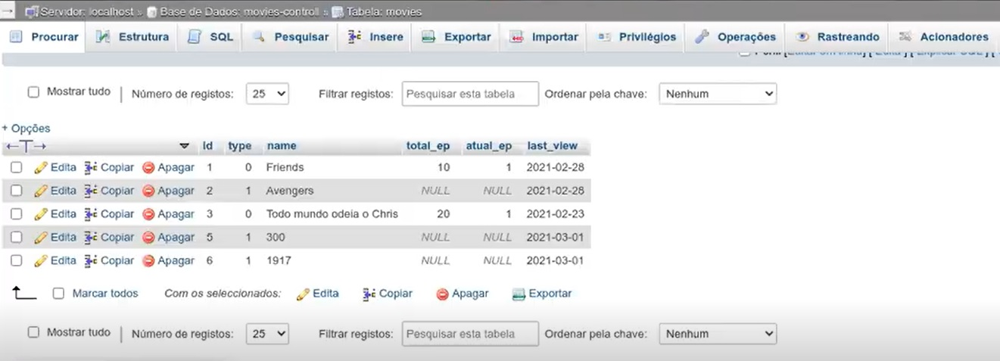
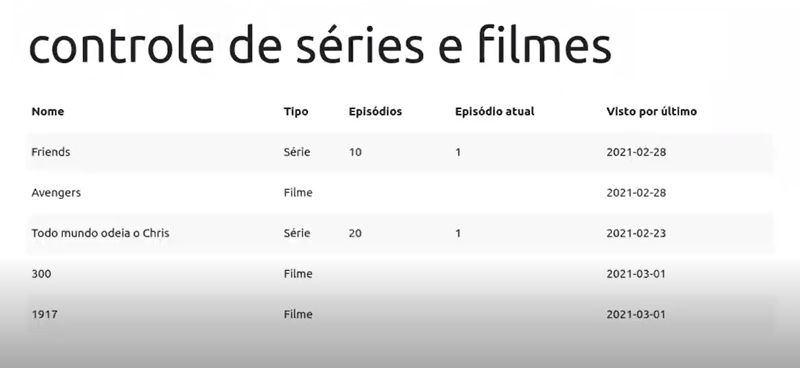

# Projeto DIO: Banco de dados de controle de séries e filmes assistidos

### Desafio de projeto para criação de um banco de dados para acompanhar filmes e séries assistidas.

### Projeto original de Nathally Souza
### Disponível em: https://github.com/nathyts/movies-controll

---

Este projeto básico visa mostrar a construção de uma página de acompanhamento de filmes e séries assistidas. A aplicação utiliza o banco de dados MySQL para o back-end e a linguagem Javascript para o front-end.

### Imagem do banco de dados:

### Imagem da página de acompanhamento:

